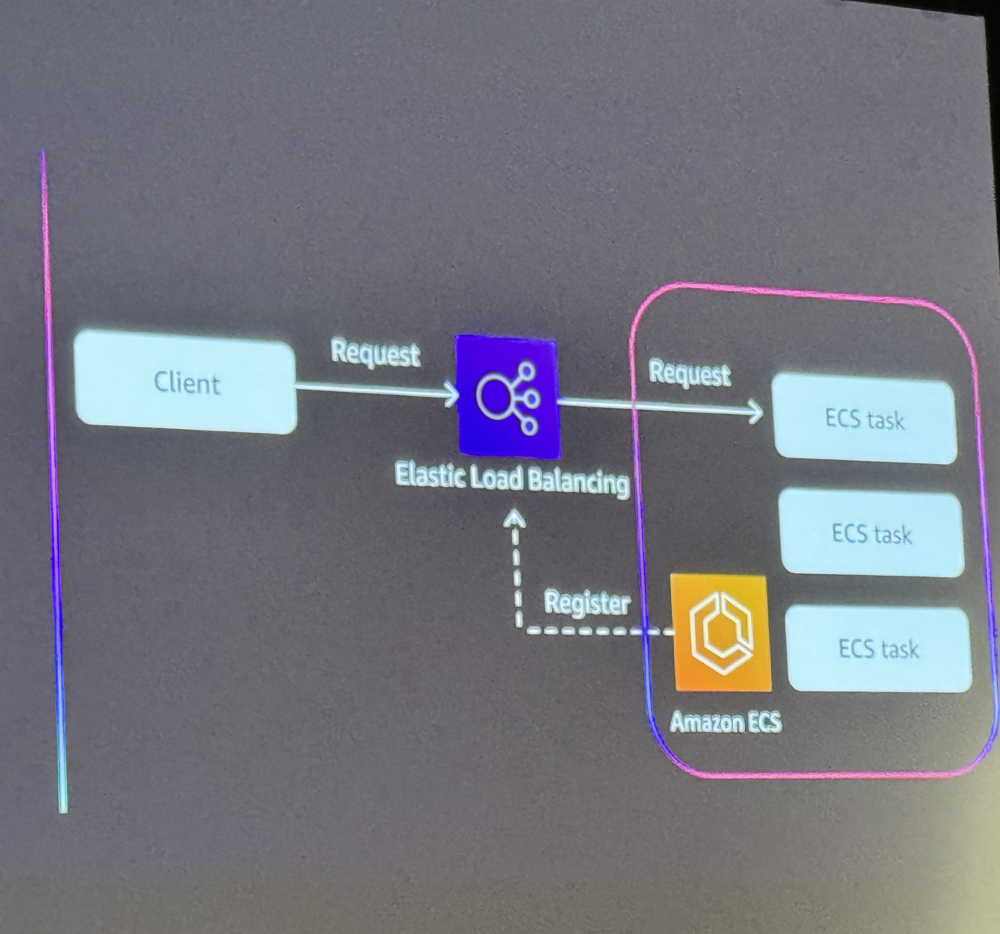

# Optimizing your Amazon ECS Application Networking Strategy

**Speakers:** Ashok Srirama, Sai Charan Teja Gopaluni

---

## Overview

Amazon ECS provides multiple networking strategies for microservices communication:

- **ECS Service Discovery** - DNS-based discovery using AWS Cloud Map
- **ECS Service Connect** - Service mesh-lite with built-in proxies
- **VPC Lattice** - Modern service networking across VPCs and accounts




---

## Use Case: eCommerce Application

### Architecture Overview

**Infrastructure:**

- VPC spanning 3 Availability Zones
- 4 microservices: UI, Product, Orders, Inventory

**Requirements:**

- Public connectivity
- Firewall protection
- CDN integration
- Encryption (TLS)

### Traffic Flow

```
CDN
  ↓
ELB (with optional WAF + TLS)
  ↓
UI Service
  ↓ (namespace call: product.retailed.namespace)
Product Service
  ↓
Inventory Service
```

### Service-to-Service Communication

**VPC Lattice Integration:**

- Connects Product, Inventory, and Order services
- Regional service networking
- No manual network configuration needed
- Uses AWS backbone infrastructure
- Simplifies cross-service connectivity without managing security groups

---

## Networking Strategy Comparison

### ECS Service Discovery

- DNS-based service discovery via AWS Cloud Map
- Manual security group configuration required
- VPC-bound communication

### ECS Service Connect

- Built on Service Discovery with proxy layer
- **Provides authentication and authorization**
- Service mesh-lite capabilities
- Built-in load balancing and observability

### VPC Lattice

- Service networking layer across VPCs and accounts
- No network configuration complexity
- Regional service connectivity
- AWS-managed backbone routing
